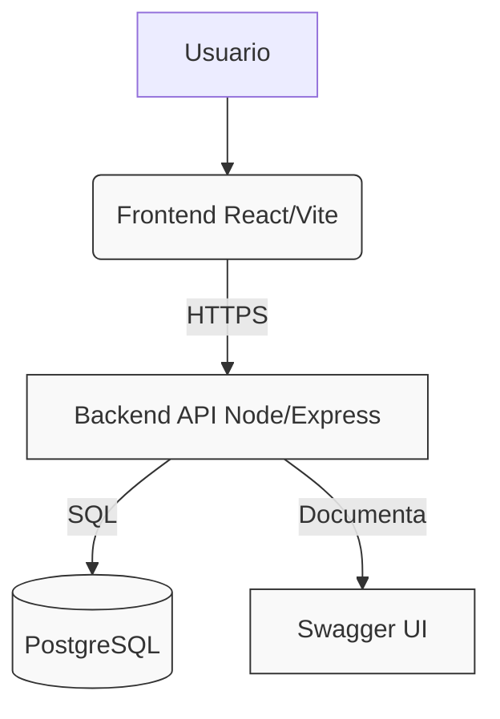
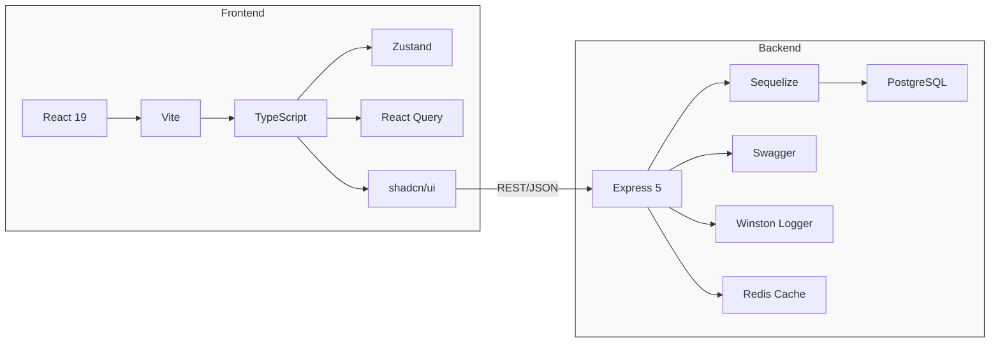
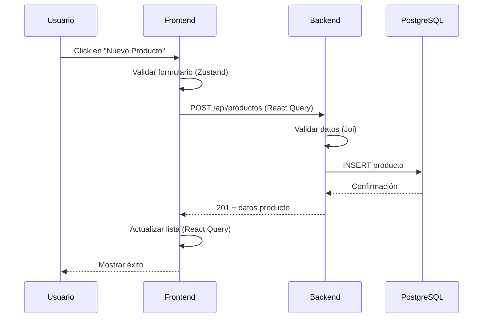

# Sistema de Inventario Herramientas
## Arquitectura Moderna y Minimalista

### Visión General
Aplicación full-stack separada en frontend React y backend Node.js/Express con comunicación RESTful y autenticación JWT.

### Módulos Actuales

**Frontend (`/frontend-app`)**
- React 19 + Vite + TypeScript
- Enrutamiento básico (react-router-dom pendiente)
- Comunicación API mediante fetch/axios (por implementar)
- Estado local de componentes (pendiente de Context/Zustand)

**Backend (`/herramientas-node-api`)**
- Express 5 + Sequelize ORM
- Arquitectura en capas:
  - Routes → Controllers → Models
  - Middleware de autenticación y manejo de errores
  - Documentación automática con Swagger
- Modelos: Usuario, Producto, Categoria, Cliente, Venta, DetalleVenta

### Oportunidades de Mejora

#### Frontend
- ⚡ Estado global: Implementar Zustand o Jotai (minimalista)
- 🎨 UI Library: Adoptar shadcn/ui o Radix Primitives
- 🔄 Data Fetching: React Query para caché y sincronización
- 🧪 Testing: Vitest + React Testing Library
- 📱 PWA: Workbox para capacidades offline

#### Backend
- ⚡ Performance: Implementar Redis para caché de consultas frecuentes
- 🔒 Seguridad: Helmet.js, rate limiting, validación avanzada con Joi
- 📊 Observabilidad: Winston logger + tracking de requests
- ♻️ Arquitectura: Considerar hexagonal/clean architecture para escalabilidad
- 🧪 Testing: Jest + Supertest para pruebas de integración

#### Infraestructura
- 🐳 Docker Compose para desarrollo consistente
- 🌐 Variables de entorno tipificadas con zod
- 📦 CI/CD básico con GitHub Actions
- 📋 Documentación: Storybook para componentes frontend

### Arquitectura Propuesta (Minimalista)

### Flujo de Datos Ejemplo

### Principios de Diseño
1. **Separación clara de responsabilidades** - Cada capa tiene un único propósito
2. **Minimalismo activo** - Solo agregar dependencias que resuelvan problemas reales
3. **Tipo fuerte end-to-end** - TypeScript en frontend, validación estricta en backend
4. **Documentación como código** - Swagger actualizado automáticamente, comentarios JSDoc
5. **Observabilidad inherente** - Logging estructurado y métricas básicas desde el inicio

### Próximos Pasos
1. Implementar Zustand para estado global en frontend
2. Agregar React Query para manejo de estado de servidor
3. Mejorar validación backend con Joi
4. Configurar Docker Compose para desarrollo
5. Establecer pipeline básico de CI

---
*Diseño pensado para evolucionar con el producto, no para sobreingeniería desde el inicio.*